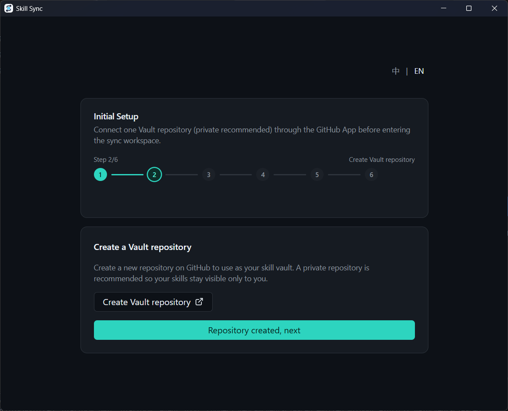
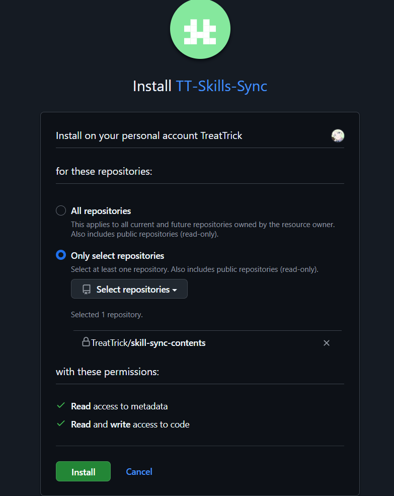
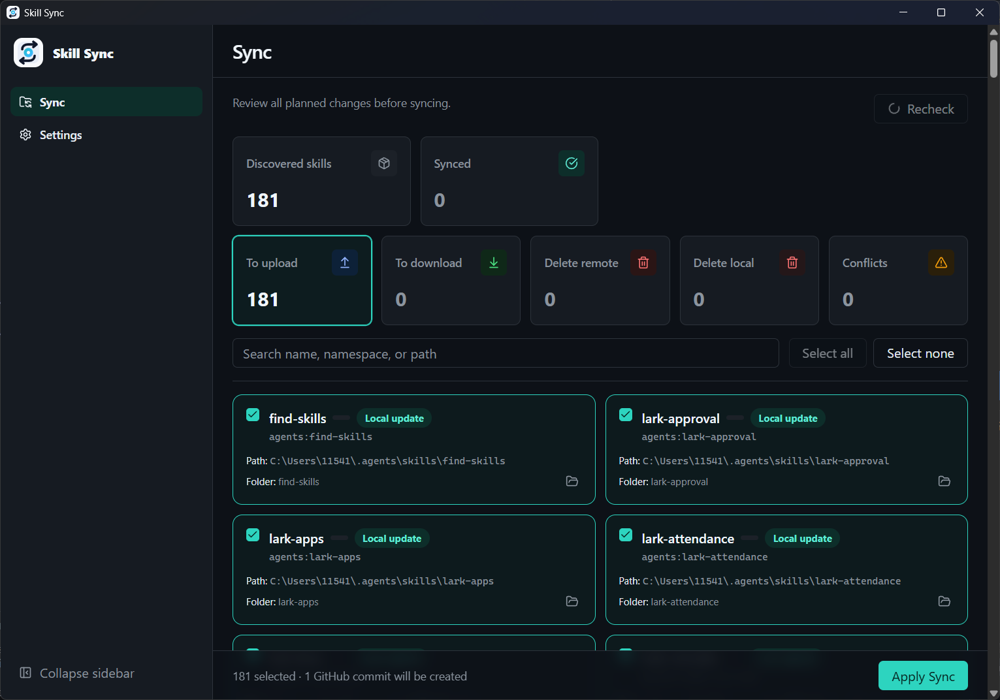
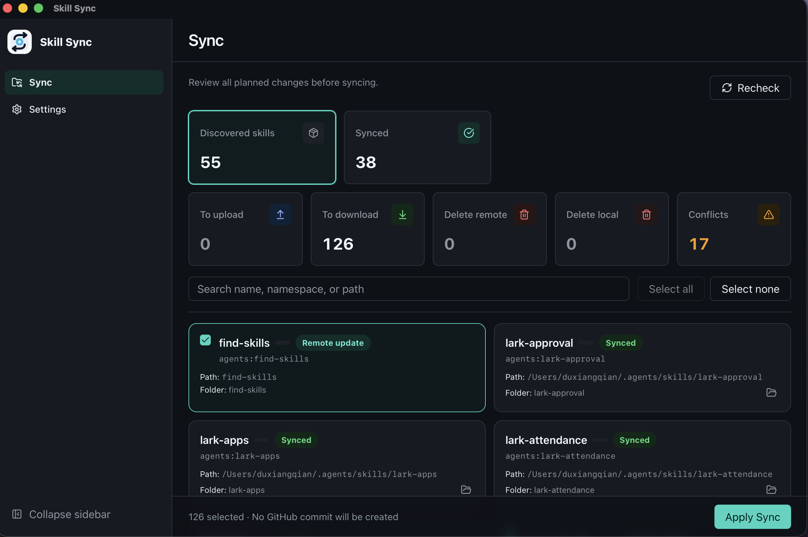
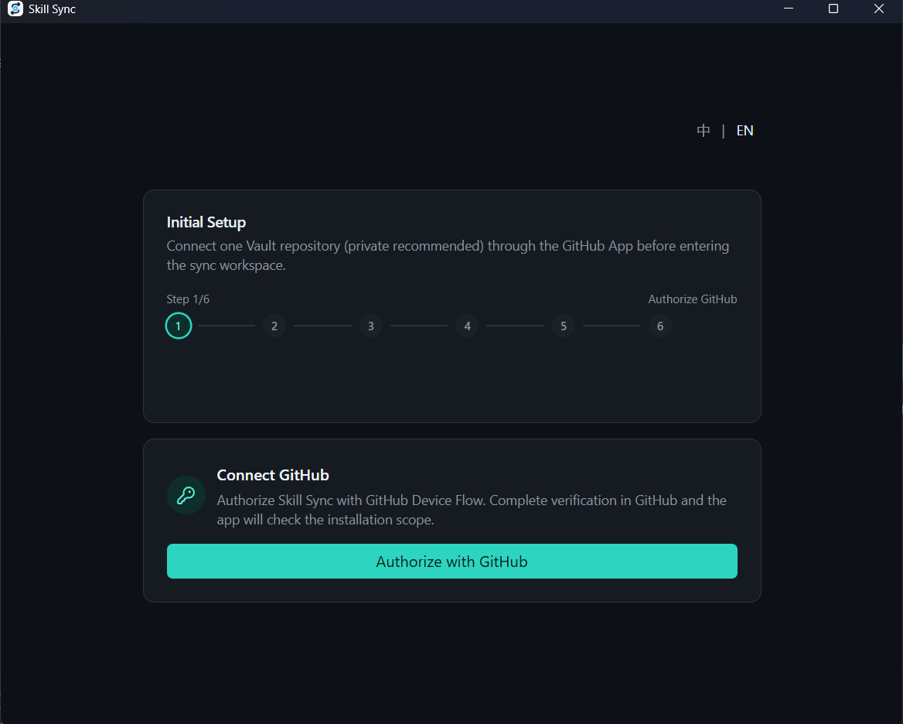
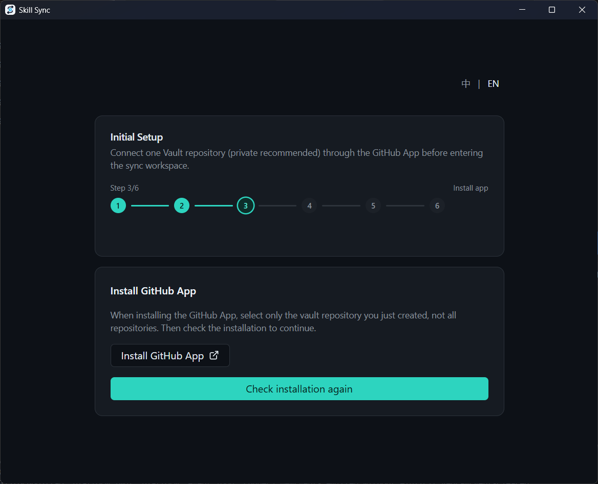
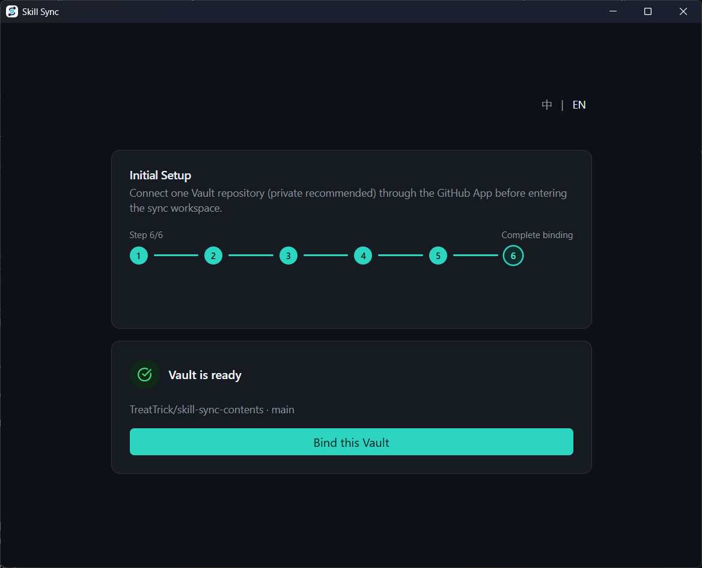

<p align="center">
  
</p>

<h1 align="center">Skill Sync</h1>

<p align="center">
  <strong>Keep your AI agent Skills in sync across machines through your own GitHub Vault.</strong>
</p>

<p align="center">
  <a href="README.md">English</a> · <a href="README.zh-CN.md">简体中文</a>
</p>

<p align="center">
  <a href="https://github.com/TreatTrick/skill-sync/releases/latest"></a>
  <a href="LICENSE"></a>
  <a href="https://github.com/TreatTrick/skill-sync/releases/latest"></a>
</p>

## See Skill Sync in action

Your Skills stay in their existing tool directories. Skill Sync gives you a clear, local workflow for moving them through a GitHub repository you control.

### Your Vault, your repository

Create a dedicated GitHub repository as the Vault. A private repository is recommended so your Skill files remain visible only to you.



### Only the repository you select

Install the GitHub App for the Vault repository only. Skill Sync needs read and write access to repository contents plus read-only metadata, not access to every repository you own.



### Review every change before it happens

See uploads, downloads, proposed deletes, and conflicts before applying anything. Search the plan, inspect individual Skills, and choose exactly which changes to sync.



### Continue on another machine without losing edits

Connect the same Vault on another computer to download remote Skills. Local and remote changes stay visible, and conflicts require an explicit choice instead of silently overwriting work.



## Why Skill Sync

Copying Skills by hand between computers is slow and makes it easy to overwrite a newer edit. Skill Sync gives Codex, Claude Code, and general agent Skills one GitHub Vault (a private repository is recommended), while keeping scanning, comparison, and apply operations on your machine.

There is no SaaS account or custom sync server, no Git, PAT, or SSH setup, and no telemetry.

## Highlights

- **Local-first:** your Skills stay in their normal tool directories and sync through a repository you control (a private one is recommended).
- **Preview before apply:** review uploads, downloads, conflicts, and proposed deletes before anything changes.
- **Explicit conflict choices:** when both sides changed, you decide whether to keep local content, use remote content, or skip.
- **Content-based comparison:** a three-way `base` / `local` / `remote` content-hash comparison detects real changes without relying on timestamps.
- **Safer deletes:** deletes are advisory and require explicit selection; accepted local deletes go to a local trash directory.
- **Recovery-aware apply:** interrupted applies retain recovery state so the app can resume instead of blindly repeating completed work.

## How it works

1. Start in-app **Onboarding** and authorize with the GitHub App Device Flow.
2. Install the GitHub App for selected repositories and bind exactly one repository (private recommended) as the Vault.
3. Open **Sync**, preview the plan, resolve any conflicts, and explicitly apply the selected changes.

The workspace is available only after the Vault is ready. Ongoing configuration lives in **Settings**.

## Supported directories

V1 scans these fixed user-level roots:

| Namespace     | Root               |
| ------------- | ------------------ |
| `agents`      | `~/.agents/skills` |
| `codex`       | `~/.codex/skills`  |
| `claude-code` | `~/.claude/skills` |

Project-level directories and custom roots are outside V1. The reserved `~/.codex/skills/.system` directory is excluded from scanning.

## Vault and sync model

The Vault has exactly this content layout:

```text
manifest.json
blobs/sha256/<sha256>.skill.zip
```

Each Skill is packed as a canonical ZIP whose content hash determines its content-addressed blob path. The manifest is the remote index. Skill Sync compares the last successfully synced `base` hash with current `local` and `remote` hashes to classify uploads, downloads, deletes, and conflicts.

The remote Vault does not contain credentials, local sync state, trash, or recovery data. See the [GitHub Vault design](docs/github-base-refactor-design.md) for protocol and conflict details.

## Privacy and safety

- The GitHub App requests only **Contents: read and write** and **Metadata: read-only**.
- Installation must use **selected repositories** and expose exactly one Vault repository to Skill Sync.
- A private repository is the recommended default. A public repository is allowed, but its Skill files and Git history are visible to everyone; Skill Sync asks you to confirm before binding a public Vault.
- Credentials are stored in the operating system keyring. The desktop app contains no GitHub App client secret or private key.
- Skill Sync has no telemetry and does not operate a SaaS account or custom sync server.
- Remote deletes remove manifest entries. Accepted local deletes move Skill directories into the local trash area instead of permanently deleting them.
- Once an apply has made persistent changes, failures are recorded for recovery and new sync work is held until recovery is resumed.

## Getting started

1. Download the Windows x64 or Apple Silicon installer from the latest [GitHub Release](https://github.com/TreatTrick/skill-sync/releases/latest). Windows builds are available as EXE and MSI installers.
2. Install and launch Skill Sync. Windows may show a security warning because its current installer is unsigned.
3. Complete authorization and Vault binding from the in-app **Onboarding** flow.
4. Preview and apply your first plan from **Sync**.

Onboarding is the normal authorization path. If you do not yet have a repository, Onboarding can open GitHub's new-repository page for you; after creating one, install or adjust the GitHub App and re-check. If needed, you can also open the [direct GitHub App installation page](https://github.com/apps/tt-skills-sync/installations/new), select repositories, and grant the App access to exactly one Vault repository (private recommended).

<details>
<summary><strong>Complete 7-step walkthrough</strong></summary>

### 1. Authorize GitHub

Choose **Authorize with GitHub** and complete the Device Flow verification in your browser. Skill Sync checks the GitHub App installation after authorization.



### 2. Create the Vault repository

Open GitHub's new-repository page from Onboarding and create the repository that will hold your Skills. Use a private repository unless you intentionally want the files and history to be public.


### 3. Start the GitHub App installation

Return to Onboarding, open the GitHub App installation, and use **Check installation again** after completing the GitHub step.



### 4. Grant access to the Vault only

On GitHub, choose **Only select repositories**, select the single Vault repository, review the requested permissions, and install the App.


### 5. Bind the ready Vault

When Skill Sync confirms that the repository is ready, verify the owner, repository, and branch, then choose **Bind this Vault**.



### 6. Preview and upload local Skills

Review the discovered Skills and the planned upload. Select the items you want, then apply the plan to create the first Vault commit.


### 7. Sync on another machine

Install Skill Sync on the other computer and connect the same Vault. Review downloads and any conflicts, choose the desired content for each conflict, and apply the selected changes.


</details>

## Build from source

Prerequisites: Node.js 20+, the repository-managed Rust 1.88.0 toolchain, and the [Tauri v2 system dependencies](https://v2.tauri.app/start/prerequisites/). The application itself does not require Git; Git is needed here only to clone the source repository.

```bash
git clone https://github.com/TreatTrick/skill-sync.git
cd skill-sync
npm install

npm run tauri dev
npm run tauri build
```

## Development checks

Run the complete check suite before submitting a change:

```bash
npm run typecheck
npm run format:check
npm run lint
npm run build
npm run rust:fmt:check
npm run rust:clippy
npm run rust:test
```

## Tech stack

- [Tauri 2](https://v2.tauri.app/) desktop shell with a Rust 1.88.0 backend
- [Svelte 5](https://svelte.dev/) and [SvelteKit](https://svelte.dev/docs/kit) with TypeScript
- Tailwind CSS 4 and shadcn-svelte UI primitives
- TanStack Svelte Query for remote state and Zod for response validation

## Project structure

```text
src/
  routes/
  app/
  modules/
  shared/
src-tauri/
  src/
docs/
  github-base-refactor-design.md
```

## Contributing

Discuss larger changes in [GitHub Issues](https://github.com/TreatTrick/skill-sync/issues) before implementation. Keep pull requests focused, run the complete development checks above, and submit them through [GitHub Pull Requests](https://github.com/TreatTrick/skill-sync/pulls).

## License

[MIT](LICENSE) © 2026 TreatTrick
