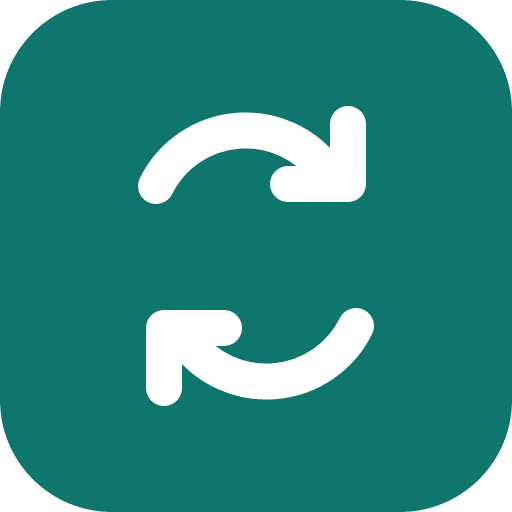
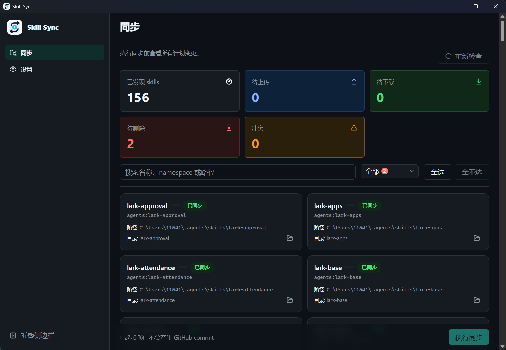
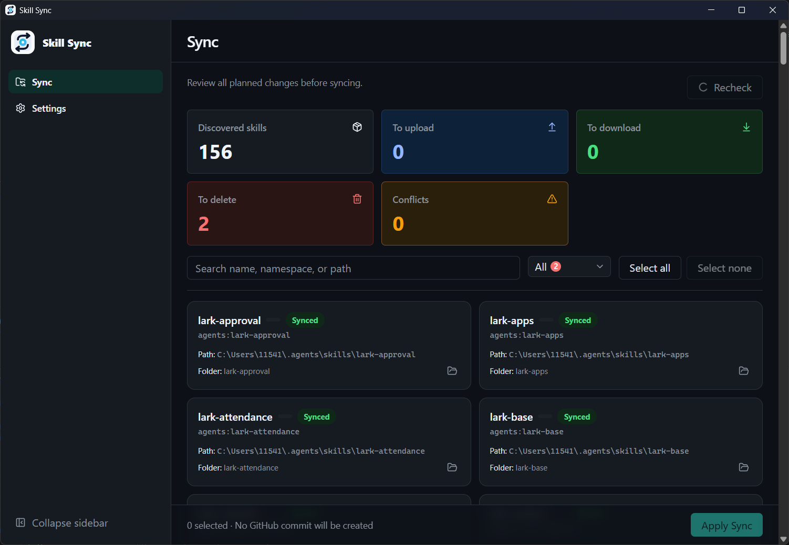

<p align="center">
  
</p>

<h1 align="center">Skill Sync</h1>

<p align="center">
  <strong>通过你自己的私有 GitHub Vault，让 AI agent Skills 在多台电脑之间保持同步。</strong>
</p>

<p align="center">
  <a href="README.md">English</a> · <a href="README.zh-CN.md">简体中文</a>
</p>

<p align="center">
  <a href="https://github.com/TreatTrick/skill-sync/releases/latest"></a>
  <a href="LICENSE"></a>
  <a href="https://github.com/TreatTrick/skill-sync/releases/latest"></a>
</p>

## 软件截图

### 中文界面



### 英文界面



## 为什么选择 Skill Sync

在不同电脑之间手动复制 Skills 不仅费事，也很容易用旧内容覆盖新修改。Skill Sync 为 Codex、Claude Code 和通用 agent Skills 提供一个私有 GitHub Vault，同时在本机完成扫描、比较和 apply。

无需 SaaS 账号或自建同步服务，无需配置 Git、PAT 或 SSH，也没有遥测。

## 核心亮点

- **本地优先：** Skills 保留在各工具原本的目录中，通过你掌控的私有仓库同步。
- **apply 前预览：** 在发生变更前检查上传、下载、冲突和建议删除项。
- **冲突由你决定：** 两端都发生修改时，可明确选择保留本地、采用远端或跳过。
- **按内容比较：** 使用 `base` / `local` / `remote` 三方内容 hash 判断真实变化，不依赖文件时间。
- **更安全的删除：** 删除属于 advisory 操作，必须显式选择；接受本地删除后，目录会进入本机 trash。
- **可恢复的 apply：** apply 中断时保留恢复状态，继续执行时不会盲目重复已经完成的操作。

## 工作方式

1. 从应用内 **Onboarding** 开始，通过 GitHub App Device Flow 授权。
2. 使用 selected repositories 安装 GitHub App，并将唯一一个私有仓库绑定为 Vault。
3. 进入 **Sync** 预览计划、处理冲突，再显式 apply 已选变更。

只有 Vault 就绪后才能进入工作区，后续配置位于 **Settings**。

## 支持的目录

V1 扫描以下固定的用户级 root：

| Namespace     | Root               |
| ------------- | ------------------ |
| `agents`      | `~/.agents/skills` |
| `codex`       | `~/.codex/skills`  |
| `claude-code` | `~/.claude/skills` |

项目级目录和自定义 root 不属于 V1。扫描会排除保留目录 `~/.codex/skills/.system`。

## Vault 与同步模型

私有 Vault 只使用以下内容布局：

```text
manifest.json
blobs/sha256/<sha256>.skill.zip
```

每个 Skill 都会打包为 canonical ZIP，其内容 hash 决定内容寻址的 blob 路径，manifest 则作为远端索引。Skill Sync 将上次成功同步的 `base` hash 与当前 `local`、`remote` hash 对比，从而判断上传、下载、删除和冲突。

远端 Vault 不包含凭证、本机同步状态、trash 或恢复数据。协议与冲突处理细节请参阅 [GitHub Vault 设计](docs/github-base-refactor-design.md)。

## 隐私与安全

- GitHub App 仅申请 **Contents: read and write** 与 **Metadata: read-only** 权限。
- installation 必须使用 **selected repositories**，并且只向 Skill Sync 开放一个私有 Vault 仓库。
- 凭证保存在操作系统 keyring 中，桌面应用不包含 GitHub App client secret 或 private key。
- Skill Sync 没有遥测，也不运营 SaaS 账号或自建同步服务。
- 删除远端内容只会移除 manifest 条目；接受本地删除时，Skill 目录会移入本机 trash，而不是永久删除。
- apply 一旦产生持久化变更，后续失败会写入恢复状态；恢复继续完成前，不会开始新的同步任务。

## 开始使用

1. 从最新的 [GitHub Release](https://github.com/TreatTrick/skill-sync/releases/latest) 下载 Windows x64 或 Apple Silicon 安装包。Windows 版本提供 EXE 和 MSI 安装包。
2. 安装并启动 Skill Sync。由于当前 Windows 安装包未签名，Windows 可能显示安全警告。
3. 在应用内 **Onboarding** 完成授权和 Vault 绑定。
4. 进入 **Sync** 预览并 apply 第一份同步计划。

正常授权入口是 Onboarding。如有需要，也可打开 [GitHub App 直接安装页面](https://github.com/apps/tt-skills-sync/installations/new)，选择 repositories，并且只向 App 授予一个私有 Vault 仓库的访问权限。

## 从源码构建

前置条件：Node.js 20+、仓库管理的 Rust 1.88.0 toolchain，以及 [Tauri v2 系统依赖](https://v2.tauri.app/start/prerequisites/)。应用本身不依赖 Git；这里只在克隆源码仓库时需要 Git。

```bash
git clone https://github.com/TreatTrick/skill-sync.git
cd skill-sync
npm install

npm run tauri dev
npm run tauri build
```

## 开发检查

提交改动前，请运行完整检查：

```bash
npm run typecheck
npm run format:check
npm run lint
npm run build
npm run rust:fmt:check
npm run rust:clippy
npm run rust:test
```

## 技术栈

- [Tauri 2](https://v2.tauri.app/) 桌面应用外壳与 Rust 1.88.0 后端
- [Svelte 5](https://svelte.dev/) 和 [SvelteKit](https://svelte.dev/docs/kit)，使用 TypeScript
- Tailwind CSS 4 与 shadcn-svelte UI primitives
- TanStack Svelte Query 管理远端状态，Zod 校验响应数据

## 项目结构

```text
src/
  routes/
  app/
  modules/
  shared/
src-tauri/
  src/
docs/
  github-base-refactor-design.md
```

## 参与贡献

较大的改动请先在 [GitHub Issues](https://github.com/TreatTrick/skill-sync/issues) 中讨论。Pull Request 应保持聚焦，提交前运行上面的完整开发检查，并通过 [GitHub Pull Requests](https://github.com/TreatTrick/skill-sync/pulls) 提交。

## 许可证

[MIT](LICENSE) © 2026 TreatTrick
